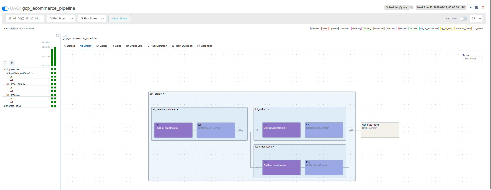

# DBT Airflow GCS Lab 🚀

Ten projekt to zaawansowane laboratorium integrujące **Apache Airflow**, **dbt (Data Build Tool)**, **Google Cloud Platform (BigQuery & GCS)** oraz **OpenLineage (Marquez)**. Projekt demonstruje nowoczesne podejście do inżynierii danych, w tym orkiestrację procesów ETL/ELT, walidację danych za pomocą Python Models w dbt oraz pełne śledzenie pochodzenia danych (data lineage).

## �️ Stos Technologiczny

### **Orkiestracja i Środowisko**
*   **Apache Airflow 2.10.4**: Zarządzanie i harmonogramowanie procesów (poprzez `astro-runtime:13.4.0`).
*   **Astronomer Cosmos 1.8.2**: Biblioteka integrująca dbt z Airflow, pozwalająca na renderowanie modeli dbt jako natywnych zadań Airflow.
*   **Docker & Docker Compose**: Konteneryzacja całego środowiska (Airflow, Postgres, Marquez).

### **Transformacja Danych (dbt)**
*   **dbt-core 1.8.x**: Główny silnik transformacji.
*   **dbt-bigquery 1.8.2**: Adapter do Google BigQuery.
*   **dbt-postgres 1.8.2**: Adapter do PostgreSQL (wykorzystywany do lokalnych testów/metadanych).
*   **openlineage-dbt 1.28.0**: Integracja z OpenLineage dla dbt.
*   **dbt Packages**:
    *   `dbt-labs/dbt_utils:1.1.1`: Zestaw pomocniczych makr i testów.
    *   `dbt-labs/dbt_external_tables:0.8.0`: Obsługa zewnętrznych tabel w GCS.

### **Analityka i Przechowywanie (GCP)**
*   **Google BigQuery**: Docelowa hurtownia danych (Data Warehouse, projekt: `lrz-ecommerce-test`).
*   **Google Cloud Storage (GCS)**: Data Lake dla surowych danych (CSV).
*   **BigQuery Python Models**: Wykorzystanie Pythona wewnątrz dbt do zaawansowanej walidacji danych (Serverless Dataproc).

### **Monitoring i Metadata**
*   **OpenLineage & Marquez 0.48.0**: Śledzenie pochodzenia danych (Data Lineage) i metadanych zadań w czasie rzeczywistym.
*   **Slack/Email Alerts**: Zintegrowane powiadomienia o błędach w DAG-ach.

## 🚀 Główne Funkcjonalności

1.  **Zewnętrzne Tabele GCS**: Automatyczne mapowanie plików CSV z GCS na tabele zewnętrzne w BigQuery przy użyciu `dbt_external_tables`.
2.  **Zaawansowana Walidacja (Python Models)**: Model `stg_events_validated.py` realizuje złożoną walidację JSON-ów wewnątrz dbt, wykorzystując środowisko Pythonowe BigQuery.
3.  **Dynamiczna Dokumentacja**: Hosting dokumentacji dbt bezpośrednio w interfejsie Airflow poprzez autorski plugin `DbtDocsPlugin`.
4.  **Data Lineage**: Wizualizacja przepływu danych od GCS, przez modele dbt, aż po końcowe tabele faktów w interfejsie Marquez.
5.  **Bezpieczeństwo i Alerty**: Obsługa sekretów (np. haseł do bazy) oraz mechanizmy powiadomień Slack/Email w przypadku awarii.

## 📂 Struktura Projektu

```text
dbt-airflow-lab/
├── dags/
│   └── dbt_dag.py             # DAG Airflow orkiestrujący dbt (Cosmos)
├── dbt_gcs_project/           # Główny projekt dbt
│   ├── models/
│   │   ├── staging/           # Warstwa Staging (źródła GCS, walidacja Python)
│   │   └── core/              # Warstwa Core (tabele faktów i wymiarów)
│   ├── analyses/              # Skrypty analityczne i walidacyjne
│   ├── macros/                # Własne makra dbt
│   ├── dbt_project.yml        # Konfiguracja projektu dbt
│   ├── packages.yml           # Zależności dbt
│   └── profiles.yml           # Konfiguracja połączenia z BigQuery
├── plugins/
│   └── dbt_docs_plugin.py     # Plugin Airflow do serwowania dokumentacji dbt
├── Dockerfile                 # Definicja obrazu Airflow (Astro)
├── docker-compose.yaml        # Orkiestracja usług (Airflow, Marquez, Postgres)
├── marquez.yml                # Konfiguracja Marqueza
└── setup_gcp.sh / setup_gcp.ps1  # Skrypty pomocnicze do konfiguracji GCP
```

## 🚀 Uruchomienie Projektu

1.  **Konfiguracja GCP**:
    Upewnij się, że masz skonfigurowane poświadczenia GCP (ADC lub Service Account JSON) oraz dostęp do projektu BigQuery.
    Uruchom skrypt konfiguracyjny z katalogu `dbt_gcs_project`:
    - Windows: `.\dbt_gcs_project\setup_gcp.ps1`
    - Linux/macOS: `./dbt_gcs_project/setup_gcp.sh`
    Skrypty te włączą niezbędne API, skonfigurują sieć VPC oraz utworzą bucket i dataset.

2.  **Uruchomienie środowiska**:
    ```bash
    docker compose up -d --build
    ```
    *Podpowiedź:* Środowisko automatycznie zainstaluje paczki dbt i utworzy użytkownika `admin` przy pierwszym starcie.

3.  **Weryfikacja instalacji dbt**:
    Paczki dbt są instalowane w kontenerze w folderze `/tmp/dbt_packages`. Możesz sprawdzić status:
    ```bash
    docker exec -it dbt-airflow-lab-airflow-1 bash -c "cd dbt_project && dbt deps"
    ```

4.  **Uruchomienie DAG-a**:
    Przejdź do Airflow UI ([http://localhost:8080](http://localhost:8080)) i włącz DAG `gcp_ecommerce_pipeline`.

## 🖼️ Zrzut ekranu DAG-a



Widok Graph przedstawia zadania dbt (staging/core) oraz krok generowania dokumentacji dbt w Airflow.

## 🌐 Dostęp do Usług

| Usługa | URL / Port | Opis |
| :--- | :--- | :--- |
| **Airflow Webserver** | [http://localhost:8080](http://localhost:8080) | Zarządzanie procesami (użytkownik/hasło: `admin`/`admin`) |
| **Marquez Web UI** | [http://localhost:3000](http://localhost:3000) | Wizualizacja Data Lineage |
| **dbt Documentation** | [http://localhost:8080/dbt_docs/](http://localhost:8080/dbt_docs/) | Statyczna dokumentacja dbt serwowana przez Airflow |
| **Marquez API** | `localhost:5000` | Endpoint OpenLineage (Namespace: `gcp-bigquery-prod`) |

## 🧪 Walidacja i Testy

Projekt kładzie duży nacisk na jakość danych:
*   **Testy dbt**: `unique`, `not_null` w `schema.yml`.
*   **Python Validation**: Model `stg_events_validated.py` sprawdza strukturę JSON w kolumnie `event_body`.
*   **External Tables**: Weryfikacja dostępności danych w GCS.

---
*Projekt stworzony w celach edukacyjnych i demonstracyjnych.*
